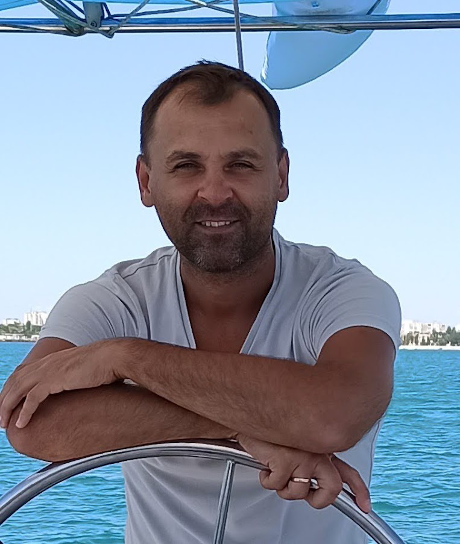

# Дроздов Дмитрий Александрович

Дата рождения: 30.05.1982г.

т. моб. +7 9048904736

Drozdov.Dim@bk.ru

## Опыт работы

### С 14.10.2011 текущее место работы ООО «Тотговый Дом ТеплоТрейд»
Менеджер отдела прямых продаж
* Выполнение плана продаж, сэндвич панели производства ТЕРМОЛЕНД, теплоизоляционные материалы марки ROCKWOOL, теплоизоляционные материалы марки ISOVER
*	Работа с проектными организациями.
*	Сбор и анализ информации о ситуации на рынке
*	Поиск новых партнёров
*	Ведение переговоров на всех уровнях
*	Составление отчетности, анализ, планирование личных продаж.

### 27.10.2009-13.10.2011 ООО «Инструмент-сервис»
Менеджер отдела прямых продаж
*	Выполнение плана продаж
*	Продвижение брендов «Bosch и JET»(Электроинструменты, станки и оснастка)
*	Организация и проведение демонстраций инструмента на объектах строительства 
*	Сбор и анализ информации о ситуации на рынке
*	Поиски новых партнёров
*	Ведение переговоров на всех уровнях
*	Составление отчетности, анализ, планирование личных продаж.

### 19.04.2008 – 21.07.2009 ООО «Чешская страховая компания»
Менеджер по продажам
*	Активный поиск клиентов.
*	Формирование клиентской базы.
*	Организация встреч презентаций.
*	Оформление договоров.
*	Сопровождение клиентов.
*	Отслеживание платежей.
*	Разработка коммерческих предложений для корпоративных клиентов

### 17.10.2006 – 21.03.2008 ФГУП «КРАСМАШ»
Старший мастер производственного участка
*	Руководство работ.
*	Разработка сменно-суточных заданий.
*	Первичный инструктаж на рабочем месте.
*	Контроль соблюдения технологической дисциплины.
*	Контроль качества готовой продукции.
*	Работа с сопроводительной документацией.
*	Контроль технического состояния оборудования.
*	Контроль соблюдения техники безопасности

### 04.05.2006 – 17.10.2006 ФГУП «КРАСМАШ»
Мастер производственного участка
*	Контроль выполнения сменно-суточных заданий.
*	Контроль  соблюдения технологической дисциплины.
*	Контроль качества готовой продукции.
*	Работа с сопроводительной документацией.
*	Контроль технического состояния оборудования.
*	Контроль соблюдения техники безопасности

### 13.11.2004 – 04.05.2006 ФГУП «КРАСМАШ»
Термист
*	Предание стали требуемых механических свойств.
*	Составление технологических карт.
*	Контроль качества готовой продукции.

## Образование
*	2001 – 2004, Государственный университет цветных металлов и золота. 
*	 Специальность - «Металловедение и термическая обработка металлов» 
*	 Квалификация – инженер.
*	1997 – 2001, Саяногорский политехнический техникум.
*	 Специальность - «Металлургия цветных металлов»
*	 Квалификация – техник

### Дополнительное образование (тренинги и семинары)
* «Поведенческие принципы в продажах», «Эффективные продажи», семинары в «Чешской страховой компании»,
* «Измерительная техника Bosch», «Электроинструменты Bosch и область применения», «Оснастка и расходные материалы Bosch», «Измерительная техника GST-berger и область применения» программа обучения менеджеров прямых продаж ООО «РобертБош»
* «Электроинструмент и промышленное оборудование JET технические характеристики и область применения», «Гаражное оборудование GROZ», «Ручной инструмент WILTON» программа обучения менеджеров «ИТА»
* «Принцип действия  двухтактных двигателей и моторов 4MIX  внутреннего сгорания бензопил» программа обучения менеджеров «Stihl»

## Личные качества
Энергичность и работоспособность, активная жизненная позиция, ответственность, честность, высокая способность к обучению.

## Семейное положение
*	Чтение, подводная охота, рыбалка, пейнтбол, горные лыжи.
*	Женат
*	Двое детей 6-и и 3-х лет